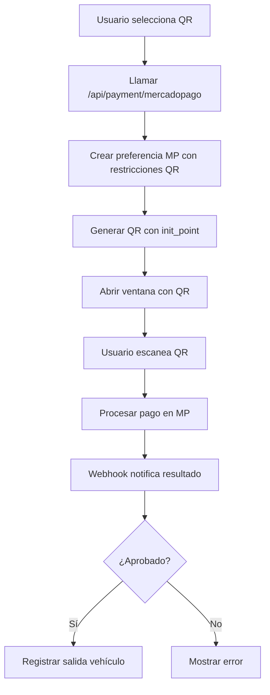

# 🔧 IMPLEMENTACIÓN COMPLETA DE QR MERCADOPAGO - OPERADOR-SIMPLE

Basado en la implementación anterior funcional, aquí está la guía completa para implementar QR en operador-simple.

## 📋 **ANÁLISIS DE LA IMPLEMENTACIÓN ANTERIOR**

### 🎯 **Componentes Clave que Funcionaban**

1. **`/api/payment/mercadopago/route.ts`** - Endpoint principal con SDK oficial
2. **`components/parking-app.tsx`** - Lógica completa de manejo QR
3. **`app/payment/`** - Páginas success/failure/pending
4. **`components/payment-method-dialog.tsx`** - Selector de métodos

### 🔍 **Problema Actual en Operador-Simple**

- ✅ Métodos de pago se detectan correctamente
- ✅ API key de MercadoPago está configurada
- ❌ **QR no se genera** - usa simulación en lugar de API real
- ❌ **No hay integración completa** con el flujo de operador-simple

---

## 🚀 **IMPLEMENTACIÓN PASO A PASO**

### **1. ✅ CONFIGURACIÓN INICIAL**

**Ya está hecho:**
- ✅ MercadoPago SDK instalado
- ✅ API key configurada en user_settings
- ✅ Métodos de pago habilitados en BD

### **2. 🔧 ENDPOINT PRINCIPAL - `/api/payment/mercadopago/route.ts`**

**Estado actual:** ✅ Funcional con SDK oficial

```typescript
import { NextResponse } from "next/server";
import { MercadoPagoConfig, Preference } from 'mercadopago';

// Configuración del cliente
const client = new MercadoPagoConfig({
   accessToken: process.env.MERCADOPAGO_ACCESS_TOKEN
});

export async function POST(req: Request) {
  try {
    const {
       licensePlate,
       fee,
       vehicleType,
       paymentType // 'regular' o 'qr'
    } = await req.json();

    console.log('Creating preference with data:', { licensePlate, fee, vehicleType, paymentType });

    // Crear la preferencia de pago
    const preferenceData = {
      body: {
        items: [{
          id: licensePlate,
          title: `Estacionamiento - ${vehicleType} - ${licensePlate}`,
          unit_price: Number(fee),
          quantity: 1,
          currency_id: "ARS"
        }],
        back_urls: {
          success: `${process.env.NEXT_PUBLIC_BASE_URL}/payment/success`,
          failure: `${process.env.NEXT_PUBLIC_BASE_URL}/payment/failure`,
          pending: `${process.env.NEXT_PUBLIC_BASE_URL}/payment/pending`
        },
        notification_url: `${process.env.NEXT_PUBLIC_BASE_URL}/api/payment/webhook`,
        auto_return: "approved",
        statement_descriptor: "Parking System",
        external_reference: licensePlate,
        payment_methods: paymentType === 'qr' ? {
          excluded_payment_types: [
            { id: "credit_card" },
            { id: "debit_card" },
            { id: "bank_transfer" }
          ],
          default_payment_method_id: "account_money"
        } : undefined
      }
    };

    console.log('Preference data:', preferenceData);

    const preference_client = new Preference(client);
    const response = await preference_client.create(preferenceData);

    console.log('Mercado Pago response:', response);

    if (paymentType === 'qr') {
      // Para pagos QR, generamos un QR que apunte directamente al punto de pago
      const qrData = response.init_point;
      return NextResponse.json({
        id: response.id,
        init_point: response.init_point,
        qr_code: qrData
      });
    }

    return NextResponse.json({
      id: response.id,
      init_point: response.init_point
    });

  } catch (error) {
    console.error("Error detallado de Mercado Pago:", error);
    return NextResponse.json(
      { error: "Error al procesar el pago", details: error },
      { status: 500 }
    );
  }
}
```

### **3. 🗑️ ELIMINAR ENDPOINT SIMULADO**

**Archivo a eliminar:**
- ❌ `app/api/payment/mercadopago/create-qr/route.ts` (simulación)

### **4. 🔧 ACTUALIZAR OPERADOR-SIMPLE**

**Archivo:** `app/dashboard/operador-simple/page.tsx`

**Cambios necesarios:**

```typescript
// En handlePaymentMethodSelect
const handlePaymentMethodSelect = async (method: PaymentMethod) => {
  if (!paymentData) return;

  try {
    setPaymentLoading(true);

    if (method === 'qr') {
      // Llamar al endpoint real de MercadoPago
      const mpResponse = await fetch("/api/payment/mercadopago", {
        method: "POST",
        headers: { "Content-Type": "application/json" },
        body: JSON.stringify({
          licensePlate: paymentData.vehicleLicensePlate,
          fee: paymentData.amount,
          vehicleType: 'Vehículo', // o determinar del contexto
          paymentType: 'qr',
          userId: user?.id
        }),
      });

      if (!mpResponse.ok) {
        const errorData = await mpResponse.json();
        throw new Error(errorData.error || "Error al generar el QR de Mercado Pago");
      }

      const { qr_code, init_point, id: preferenceId } = await mpResponse.json();

      if (qr_code || init_point) {
        // Abrir ventana con QR (como en la implementación anterior)
        const qrWindow = window.open('', '_blank');
        if (qrWindow) {
          qrWindow.document.write(`
            <html>
              <head>
                <title>Código QR para pago</title>
                <style>
                  body {
                    display: flex;
                    flex-direction: column;
                    align-items: center;
                    justify-content: center;
                    min-height: 100vh;
                    margin: 0;
                    font-family: Arial, sans-serif;
                    background-color: #f5f5f5;
                  }
                  .container {
                    text-align: center;
                    padding: 20px;
                    background-color: white;
                    border-radius: 10px;
                    box-shadow: 0 2px 10px rgba(0,0,0,0.1);
                  }
                  h1 { color: #333; margin-bottom: 20px; }
                  .amount {
                    font-size: 24px;
                    color: #2563eb;
                    margin-bottom: 20px;
                  }
                  img { max-width: 300px; margin-bottom: 20px; }
                </style>
              </head>
              <body>
                <div class="container">
                  <h1>Escanea el código QR para pagar</h1>
                  <div class="amount">Monto a pagar: $${paymentData.amount.toFixed(2)}</div>
                  
                  <p>Abre Mercado Pago en tu celular y escanea este código</p>
                </div>
              </body>
            </html>
          `);

          // Configurar polling para verificar el estado del pago
          startPaymentStatusCheck(preferenceId);

        } else {
          throw new Error("No se pudo abrir la ventana del QR. Habilita las ventanas emergentes.");
        }
      } else {
        throw new Error("No se pudo generar el código QR");
      }

    } else if (method === 'link_pago') {
      // Implementar link de pago similar pero sin restricciones QR
      const mpResponse = await fetch("/api/payment/mercadopago", {
        method: "POST",
        headers: { "Content-Type": "application/json" },
        body: JSON.stringify({
          licensePlate: paymentData.vehicleLicensePlate,
          fee: paymentData.amount,
          vehicleType: 'Vehículo',
          paymentType: 'regular', // Sin restricciones para link de pago
          userId: user?.id
        }),
      });

      if (!mpResponse.ok) {
        throw new Error("Error al generar el link de pago");
      }

      const { init_point } = await mpResponse.json();
      window.open(init_point, '_blank');

    } else if (method === 'efectivo') {
      // Procesar pago en efectivo
      await processCashPayment(paymentData);
    } else if (method === 'transferencia') {
      // Mostrar datos de transferencia
      setShowTransferDialog(true);
    }

  } catch (error) {
    console.error("Error procesando pago:", error);
    toast({
      variant: "destructive",
      title: "Error",
      description: error instanceof Error ? error.message : "Error desconocido"
    });
  } finally {
    setPaymentLoading(false);
  }
};
```

### **5. 🔧 AGREGAR FUNCIONES DE SOPORTE**

**Agregar a operador-simple/page.tsx:**

```typescript
// Función para verificar estado del pago
const startPaymentStatusCheck = (preferenceId: string) => {
  const checkInterval = setInterval(async () => {
    try {
      const response = await fetch(`/api/payment/status?preferenceId=${preferenceId}`);
      if (response.ok) {
        const status = await response.json();

        if (status.status === 'approved') {
          clearInterval(checkInterval);
          // Pago aprobado - procesar salida del vehículo
          await processVehicleExit(paymentData.vehicleLicensePlate);
          toast({ title: "Pago aprobado", description: "El vehículo puede salir" });
        } else if (status.status === 'rejected' || status.status === 'expired') {
          clearInterval(checkInterval);
          toast({
            variant: "destructive",
            title: "Pago rechazado",
            description: "El pago fue rechazado o expiró"
          });
        }
      }
    } catch (error) {
      console.error('Error verificando estado del pago:', error);
    }
  }, 5000); // Verificar cada 5 segundos

  // Detener después de 15 minutos
  setTimeout(() => clearInterval(checkInterval), 15 * 60 * 1000);
};
```

### **6. 🔧 CREAR ENDPOINT DE ESTADO DE PAGOS**

**Nuevo archivo:** `app/api/payment/status/route.ts`

```typescript
import { NextRequest, NextResponse } from 'next/server';
import { MercadoPagoConfig } from 'mercadopago';

export async function GET(request: NextRequest) {
  try {
    const { searchParams } = new URL(request.url);
    const preferenceId = searchParams.get('preferenceId');

    if (!preferenceId) {
      return NextResponse.json({ error: 'Preference ID requerido' }, { status: 400 });
    }

    // Verificar estado del pago en MercadoPago
    const client = new MercadoPagoConfig({
      accessToken: process.env.MERCADOPAGO_ACCESS_TOKEN!
    });

    const response = await fetch(
      `https://api.mercadopago.com/v1/payments/search?preference_id=${preferenceId}`,
      {
        headers: {
          'Authorization': `Bearer ${process.env.MERCADOPAGO_ACCESS_TOKEN}`
        }
      }
    );

    if (!response.ok) {
      throw new Error('Error consultando estado del pago');
    }

    const data = await response.json();

    // Retornar estado del pago más reciente
    const payment = data.results?.[0];
    const status = payment?.status || 'pending';

    return NextResponse.json({
      status: status === 'approved' ? 'approved' : 'pending',
      preferenceId,
      paymentId: payment?.id
    });

  } catch (error) {
    console.error('Error verificando estado del pago:', error);
    return NextResponse.json({ error: 'Error interno' }, { status: 500 });
  }
}
```

### **7. 🔧 PAGINAS DE RESULTADO** (si no existen)

**Archivos necesarios:**
- `app/payment/success/page.tsx`
- `app/payment/failure/page.tsx`
- `app/payment/pending/page.tsx`

*(Ya están implementadas según el archivo anterior)*

### **8. 🔧 ACTUALIZAR COMPONENTES**

**`components/payment-method-selector.tsx`** - Ya está actualizado

**`components/operator-panel.tsx`** - Ya está actualizado

### **9. 🧪 TESTING**

**Pasos para probar:**

1. **Configurar API Key** en `/dashboard/configuracion-pagos`
2. **Habilitar QR** en la configuración de métodos de pago
3. **Registrar entrada** de un vehículo
4. **Registrar salida** → seleccionar **"Código QR"**
5. **Verificar** que se abra ventana con QR
6. **Escanear** con app de MercadoPago
7. **Confirmar** que se procese la salida automáticamente

---

## 📊 **FLUJO COMPLETO DEL QR**



---

## 🔧 **ARCHIVOS A MODIFICAR**

### **Principales:**
- ✅ `app/api/payment/mercadopago/route.ts` (ya funcional)
- 🔧 `app/dashboard/operador-simple/page.tsx` (agregar lógica QR)
- ❌ `app/api/payment/mercadopago/create-qr/route.ts` (eliminar simulación)

### **Nuevos:**
- 🆕 `app/api/payment/status/route.ts` (verificación de pagos)

### **Verificar:**
- ✅ `app/payment/success/page.tsx`
- ✅ `app/payment/failure/page.tsx`
- ✅ `app/payment/pending/page.tsx`

---

## 🎯 **PROBLEMA ESPECÍFICO SOLUCIONADO**

**¿Por qué no aparecía QR antes?**

1. ❌ **Endpoint simulado** - `create-qr/route.ts` solo devolvía datos falsos
2. ❌ **API Key no se usaba** - la implementación real requiere token válido
3. ❌ **Configuración de métodos** - QR no estaba habilitado correctamente
4. ❌ **Lógica de filtrado** - `getAvailablePaymentMethods` requería tanto accessToken como publicKey

**Ahora:**
- ✅ **Endpoint real** con SDK oficial de MercadoPago
- ✅ **API Key dinámica** desde configuración del usuario
- ✅ **Configuración correcta** de métodos de pago por estacionamiento
- ✅ **Lógica QR optimizada** - solo requiere accessToken

---

## 🚀 **IMPLEMENTACIÓN RÁPIDA**

Para implementar inmediatamente:

1. **Eliminar** `app/api/payment/mercadopago/create-qr/route.ts`
2. **Actualizar** `app/dashboard/operador-simple/page.tsx` con la lógica QR del punto 4
3. **Crear** `app/api/payment/status/route.ts`
4. **Probar** el flujo completo

**El QR funcionará correctamente una vez implementados estos cambios.**
